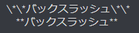
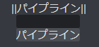
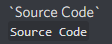
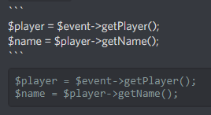
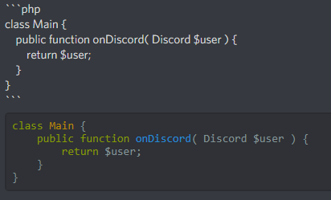

# Discord for MarkDown.

## Other languages

- [English](/mark_en.md)

***

## Pages

- [Home(jp)](/index.md)
- [Home(en)](/index_en.md)
- [Rules](/rules.md)

***

## 文字の装飾

### > 大文字

> 「\*(アスタリスク)」 で囲むことによって文字を大文字にします。  
> 

### > 下線

> 「\_(アンダーバー)」 で囲むことによって文字に下線を引きます。  
> 

### > 取り消し線

> 「\~(チルダ)」 で囲むことによって文字に取り消し線を付けます。  
> 

### > 文字の複数装飾

> 「\*(アスタリスク)」 や 「\_(アンダーバー)」 などは、重ねて装飾することが出来ます。  
>   

### > バックスラッシュ

> 「\\(バックスラッシュ)」 は装飾文字の前に置くとエスケープ(無効化)することが出来ます。  
> 

### > ガード

> 「|(パイプライン)」 で囲むと文字列が黒いガードで見えなくなります。  
>   

***

## コードの装飾( コードブロック )

### > 一行で済むもの

> 「\`(シングルクォーテーション)」 を一つで囲みます。  
> 

### > 複数行で書きたいもの

> 「\`(シングルクォーテーション)」 を三つで囲みます。  
> 

### > コードを張る際に推奨されるもの

> 「\`(シングルクォーテーション)」 を三つで囲み、  
> 最初の三つの後に拡張子を付けることが出来ます。  
>   

### > コードブロック内での装飾

> コードブロック外で装飾することによって、  
> コードブロック内の文字に反映されます。  
> 

***

## 注意

> 一部環境では、下線などが表示されない不具合があるそうです。  
> また、ソースコードやエラー文を提示する際、長くなりすぎる場合は  
> [MCBE FORUM](https://forum.mcbe.jp)様のサービス、もしくは
> [こちらのサイト](https://pastebin.com/)等を利用していただきたいです。
